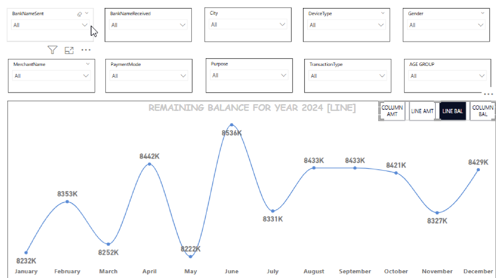

# Transaction Performance Analytics Dashboard

## Overview
Power BI dashboard analyzing UPI transaction performance patterns, regional distribution, and temporal trends for operational oversight and performance monitoring.

## Key Features
- **Performance Trend Analysis**: Monthly transaction volume tracking with pattern identification
- **Multi-dimensional Filtering**: Analysis by bank, city, merchant, payment mode, purpose, age group, and gender
- **Regional Breakdown**: City-wise transaction amounts and balance monitoring
- **Anomaly Detection**: Visual identification of performance peaks and dips

## Insights Demonstrated
- Transaction volume fluctuations throughout 2024 (peak: 1707K in May, low: 1599K in August)
- Regional transaction distribution across major cities (Bangalore, Delhi, Hyderabad, Mumbai)
- Remaining balance monitoring for financial oversight
- Multi-factor analysis capability for comprehensive performance assessment

## Technical Implementation
**Tools**: Power BI Desktop
**Dataset**: UPI transaction records (2024) with 10+ dimensional attributes
**Visualizations**: 
- Time-series line chart for trend analysis
- Interactive matrix for regional comparison
- 10 dynamic filters for detailed drill-down

## Use Case
This dashboard serves as a governance tool for:
- Monitoring transaction performance patterns
- Identifying operational anomalies requiring investigation
- Supporting data-driven decision-making for resource allocation
- Providing oversight-level insights for leadership review

## Data Source
UPI transaction dataset with anonymized payment records including bank details, merchant information, transaction types, and demographic attributes.

## Screenshots

### Page 1: Transaction Trends

### Page 2: Regional Analysis

